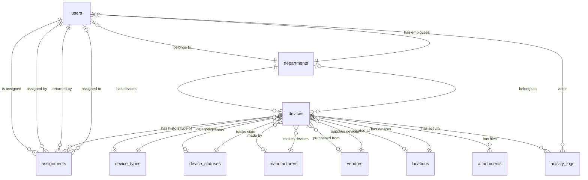

# Architecture — Jidaar Device Management System

> Every entry in this document is a **settled decision**. A new agent treats these as fixed — do not re-litigate or silently override. If you believe a change is warranted, flag it in `DECISIONS_LOG.md` with rationale first.

---

## 1. Overview

Jidaar is an IT Device Management System for tracking hardware assets (desktops, laptops, servers, networking equipment, peripherals) across an organization of ~75–150 devices and ~30–60 employees. It manages the full device lifecycle: procurement → assignment → return/transfer → maintenance → retirement, with a clean admin UI for 2–5 concurrent users.

---

## 2. Technology Stack

### 2.1 Decisions

| Layer | Technology | Version (pinned at init) |
|-------|-----------|------------------------|
| **Runtime** | Node.js | 20 LTS |
| **Framework** | Next.js (App Router) | 14 |
| **Language** | TypeScript | 5.x (strict mode) |
| **Database** | PostgreSQL | 16 |
| **ORM** | Prisma | Latest 5.x |
| **Auth** | NextAuth.js (Auth.js v5) | Latest |
| **UI Components** | shadcn/ui (Radix UI primitives) | Latest |
| **Styling** | Tailwind CSS | 3.4+ |
| **Tables** | TanStack Table v8 | Latest |
| **Forms** | React Hook Form + Zod | Latest |
| **Charts** | Recharts | Latest |
| **File Storage** | AWS SDK v3 (S3-compatible) | Latest |
| **Testing** | Vitest (unit/integration) + Playwright (E2E) | Latest |
| **Linting** | ESLint + Prettier | Latest |
| **Package Manager** | pnpm | Latest |
| **Containerization** | Docker + docker-compose | — |

### 2.2 Justification

**Next.js full-stack monolith (not separate frontend/backend):**
- Single TypeScript project eliminates type-syncing across API boundary — the #1 source of integration bugs in agent-written codebases.
- Route Handlers provide a clean REST API indistinguishable from Express for this use case.
- Server Components reduce client JS and enable server-side data fetching.
- Single Docker container for deployment (simpler than orchestrating two services at this scale).
- If we later need to serve a mobile app or third-party clients, we extract Route Handlers into a standalone service — the code structure is nearly identical to Express route handlers.

**Rejected alternatives:**
- *Express + Next.js monorepo:* Adds deployment complexity and type-sync overhead for no benefit at 2–5 concurrent users.
- *NestJS:* Over-engineered for this scale; decorator-heavy style doesn't play as well with Prisma's functional approach.

**PostgreSQL:**
- JSONB support enables the extensible device-type pattern without EAV complexity.
- Partial unique indexes enforce the one-open-assignment-per-device invariant at the database level.
- Mature, battle-tested, runs everywhere Docker runs.
- Rejected: SQLite (no JSONB, limited concurrency), MySQL (inferior JSON support for our use case).

**Prisma:**
- Type-safe database access with auto-generated TypeScript types from schema.
- Declarative schema with migrations.
- Excellent Next.js integration.
- Rejected: Drizzle (less mature for complex relations), TypeORM (poorer DX).

**shadcn/ui:**
- Built on Radix UI (accessible by default).
- Tailwind-based (consistent styling system).
- You own the component source — no dependency update breakage.
- Rejected: MUI (heavy, opinionated), Chakra (less aligned with Linear/Stripe design goal).

**Vitest + Playwright:**
- Vitest: fast, TypeScript-native, Jest-compatible API, great for unit and API integration tests.
- Playwright: reliable cross-browser E2E, better than Cypress for CI environments.
- Rejected: Jest (slower, worse ESM/TS support), Cypress (slower, less reliable in CI).

**pnpm:**
- Faster installs, stricter dependency resolution, less disk usage than npm/yarn.

---

## 3. System Architecture

```
┌─────────────────────────────────────────────────────────┐
│                    Docker Container                       │
│  ┌───────────────────────────────────────────────────┐  │
│  │              Next.js Application                    │  │
│  │                                                     │  │
│  │  ┌─────────────┐  ┌────────────────────────────┐  │  │
│  │  │   Pages &    │  │     Route Handlers          │  │  │
│  │  │   Server     │  │     (REST API)              │  │  │
│  │  │   Components │  │                              │  │  │
│  │  └──────┬──────┘  └──────────┬─────────────────┘  │  │
│  │         │                    │                      │  │
│  │  ┌──────┴────────────────────┴──────────────────┐  │  │
│  │  │           Shared Layer                         │  │  │
│  │  │  Prisma Client · Zod Schemas · Auth Helpers    │  │  │
│  │  │  Permissions · CSV Utils · S3 Client           │  │  │
│  │  └──────────────────────┬───────────────────────┘  │  │
│  └─────────────────────────┼───────────────────────────┘  │
│                            │                              │
└────────────────────────────┼──────────────────────────────┘
                             │
              ┌──────────────┼──────────────┐
              │              │              │
        ┌─────┴─────┐ ┌─────┴─────┐ ┌─────┴─────┐
        │ PostgreSQL │ │    S3     │ │  Browser  │
        │    (DB)    │ │ (storage) │ │  (client) │
        └───────────┘ └───────────┘ └───────────┘
```

**Key principle:** Everything runs in one container. PostgreSQL and S3 are external services — in production they're separate managed services or containers; in dev they're spun up via docker-compose.

---

## 4. Database Design

### 4.1 Entity-Relationship Diagram (Mermaid)



### 4.2 Tables

| Table | Purpose | Soft Delete |
|-------|---------|:-----------:|
| `users` | Employee records | Yes |
| `devices` | IT asset records | Yes |
| `device_types` | Configurable device categories (Laptop, Server, etc.) | No (soft-delete via reference blocking) |
| `device_statuses` | Configurable statuses with display colors | No |
| `departments` | Organizational departments | No |
| `locations` | Physical locations (building/floor/room) | No |
| `manufacturers` | Hardware manufacturers | No |
| `vendors` | Procurement vendors | No |
| `assignments` | Device ↔ User assignment records (history) | Yes |
| `attachments` | S3 file references for device images/files | No (cascade from device) |
| `activity_logs` | Immutable audit trail (append-only) | No |

### 4.3 Schema Details

> Full Prisma schema lives in `prisma/schema.prisma`. Below is the design rationale.

#### Users
- `employee_id`: unique, VARCHAR(50), human-readable identifier
- `role`: enum `ADMIN | TECHNICIAN | READ_ONLY`
- `status`: enum `ACTIVE | INACTIVE | TERMINATED`
- `department_id`: FK → departments (nullable for new hires before department assignment)
- Password stored as bcrypt hash (never plaintext)

#### Devices
- `asset_id`: unique, VARCHAR(50), auto-generated or user-provided
- `specifications`: JSONB column for type-specific fields. Example:
  ```json
  {
    "cpu": "Intel i7-13700K",
    "ram": "32GB DDR5",
    "storage": "1TB NVMe",
    "os": "Windows 11 Pro"
  }
  ```
  This avoids the EAV pattern. New device type = new data row with a name; the JSONB `specifications` field holds whatever fields are relevant for that type. The UI dynamically renders the relevant fields based on the device type's configuration (see `device_type_fields` below).
- `status_id`: FK → device_statuses (denormalized for query speed; the source of truth for display, but assignment status is separate)
- `purchase_date` and `warranty_expiration`: `DATE` type (no time component — these are business dates, not timestamps)
- `ip_address`: VARCHAR(45) — accommodates IPv6
- `mac_address`: VARCHAR(17) — format XX:XX:XX:XX:XX:XX

#### Device Types
- `name`: unique, human-readable (e.g., "Laptop", "Server", "Access Point")
- `category`: grouping field (e.g., "Computing", "Networking", "Peripherals")
- No soft delete — deletion blocked if any device references this type

#### Device Statuses
- `name`: unique (e.g., "Available", "Assigned", "Maintenance")
- `color`: hex or Tailwind color token for consistent badge rendering
- `sort_order`: controls display ordering
- Default statuses seeded: Available, Assigned, Maintenance, Repair, Retired, Lost, Broken, Reserved, Disposed

#### Departments / Locations / Manufacturers / Vendors
- Standard reference tables with unique names
- Deletion blocked with reference count if any device or user references them
- Locations have `name`, `building`, `floor`, `room` fields with a compound unique constraint

#### Assignments
- Core junction table with full lifecycle fields
- `assignment_date`: when the device was handed over
- `expected_return_date`: optional, used for overdue flagging
- `return_date`: NULL = currently active; non-NULL = closed
- `closed_reason`: enum `RETURNED | TRANSFERRED | LOST | RETIRED | DEACTIVATED`
- `condition_before` / `condition_after`: free-text device condition notes
- `assigned_by_id` / `returned_by_id`: audit trail of who performed the action
- **Critical constraint:** Partial unique index enforcing at most one open assignment per device:
  ```sql
  CREATE UNIQUE INDEX "assignments_one_open_per_device"
  ON "assignments" ("device_id")
  WHERE "return_date" IS NULL AND "deleted_at" IS NULL;
  ```
  This prevents two admins from assigning the same device simultaneously — the second INSERT will fail with a unique violation.

#### Activity Logs
- Append-only audit trail
- `entity_type`: 'device' | 'user' | 'assignment'
- `entity_id`: UUID of the affected record
- `action`: 'created' | 'updated' | 'deleted' | 'assigned' | 'returned' | 'transferred' | 'status_changed'
- `actor_id`: FK → users (who did it)
- `changes`: JSONB with `{ "field": { "old": "x", "new": "y" } }` for updates
- Indexed on `(entity_type, entity_id)` and `created_at`

#### Attachments
- Direct FK to `device_id` (not polymorphic — Prisma doesn't support polymorphic relations; if we need attachments on other entities later, we add separate tables or handle via raw SQL)
- `s3_key`: the object key in S3 storage
- `mime_type` and `size`: for display purposes

### 4.4 Indexes (Performance)

All indexes below are designed to keep queries under the 300ms target:

| Table | Index | Purpose |
|-------|-------|---------|
| `devices` | `status_id` | Filter by status (dashboard, lists) |
| `devices` | `device_type_id` | Filter by type |
| `devices` | `department_id` | Filter by department |
| `devices` | `manufacturer_id` | Filter by manufacturer |
| `devices` | `location_id` | Filter by location |
| `devices` | `name` (GIN/trigram) | Fuzzy search by name |
| `devices` | `asset_id` (unique) | Exact lookup |
| `devices` | `serial_number` | Search by serial |
| `users` | `department_id` | Filter by department |
| `users` | `status` | Filter active/inactive |
| `users` | `employee_id` (unique) | Exact lookup |
| `users` | `email` (unique) | Auth lookup |
| `assignments` | `device_id` | Assignment history per device |
| `assignments` | `user_id` | Assignment history per user |
| `assignments` | `return_date` | Open vs closed queries |
| `assignments` | Partial unique on `device_id WHERE return_date IS NULL` | Enforce one-open-assignment-per-device |
| `activity_logs` | `(entity_type, entity_id)` | Entity activity lookups |
| `activity_logs` | `created_at` | Recent activity, sorting |
| `attachments` | `device_id` | Attachments per device |

### 4.5 Data Integrity Rules (enforced at DB + application layer)

1. **One open assignment per device:** Partial unique index on assignments (see above). Application also checks before insert for a clear error message.
2. **Assignment/status consistency:** Device status "Assigned" implies an open assignment exists. Device status "Available" implies no open assignment. Maintenance/Repair may coexist with an open assignment. Enforced in application transactions.
3. **No orphaned deactivations:** User deactivation blocked (HTTP 409) if user has open assignments. Admin must return all devices first.
4. **Reference integrity on deletes:** Departments/Locations/Manufacturers/Vendors cannot be soft-deleted while referenced. API returns 409 with reference count.
5. **Date validation:** `warranty_expiration` must be ≥ `purchase_date`. Enforced at application layer via Zod.
6. **Format validation:** MAC address (XX:XX:XX:XX:XX:XX), IP address (IPv4/IPv6), email format — enforced via Zod schemas.

### 4.6 Dates & Timezones

- All timestamps stored as `TIMESTAMPTZ` (UTC) — `created_at`, `updated_at`, `deleted_at`
- `purchase_date` and `warranty_expiration` are pure `DATE` (no time component, no timezone)
- `assignment_date`, `expected_return_date`, `return_date` are pure `DATE`
- Display-side converts UTC timestamps to user's local timezone via `Intl.DateTimeFormat`

---

## 5. API Design

REST API served via Next.js Route Handlers under `/api/`. All endpoints return JSON with consistent envelope:

```json
{
  "data": <payload>,
  "meta": { "page": 1, "pageSize": 25, "total": 142 },
  "error": null
}
```

Error responses:

```json
{
  "data": null,
  "error": {
    "code": "VALIDATION_ERROR",
    "message": "Warranty expiration must be after purchase date",
    "details": { "warrantyExpiration": "Must be ≥ 2024-01-15" }
  }
}
```

### 5.1 Authentication Endpoints

| Method | Path | Auth | Description |
|--------|------|:----:|-------------|
| POST | `/api/auth/login` | No | Login, creates session |
| POST | `/api/auth/logout` | Yes | Destroy session |
| GET | `/api/auth/me` | Yes | Current user profile |
| POST | `/api/auth/change-password` | Yes | Change own password |

### 5.2 Device Endpoints

| Method | Path | Auth | Roles | Description |
|--------|------|:----:|-------|-------------|
| GET | `/api/devices` | Yes | All | List devices (paginated, filterable, searchable) |
| POST | `/api/devices` | Yes | Admin, Tech | Create device |
| GET | `/api/devices/:id` | Yes | All | Get device detail (includes current assignment, recent activity) |
| PUT | `/api/devices/:id` | Yes | Admin, Tech | Update device |
| DELETE | `/api/devices/:id` | Yes | Admin | Soft-delete device |
| GET | `/api/devices/:id/assignments` | Yes | All | Assignment history for device |
| GET | `/api/devices/:id/activity` | Yes | All | Activity log for device |
| POST | `/api/devices/:id/attachments` | Yes | Admin, Tech | Upload file to S3, create attachment record |
| DELETE | `/api/devices/:id/attachments/:attachmentId` | Yes | Admin, Tech | Delete attachment from S3 and DB |

**Query parameters for list endpoint:**
- `page` (default: 1), `pageSize` (default: 25, max: 100)
- `search` — searches across name, asset_id, serial_number, ip_address, mac_address, model
- `statusId`, `deviceTypeId`, `departmentId`, `manufacturerId`, `locationId`, `vendorId` — exact match filters
- `sort` — field name, prefix `-` for descending (default: `-created_at`)
- `warrantyExpiringSoon` — boolean, filter devices with warranty expiring within 30 days

### 5.3 User Endpoints

| Method | Path | Auth | Roles | Description |
|--------|------|:----:|-------|-------------|
| GET | `/api/users` | Yes | All | List users (paginated, filterable) |
| POST | `/api/users` | Yes | Admin | Create user |
| GET | `/api/users/:id` | Yes | All | Get user detail (includes assigned devices, recent activity) |
| PUT | `/api/users/:id` | Yes | Admin | Update user |
| DELETE | `/api/users/:id` | Yes | Admin | Soft-delete (blocked if open assignments exist) |
| GET | `/api/users/:id/assignments` | Yes | All | Assignment history for user |
| GET | `/api/users/:id/activity` | Yes | All | Activity log for user |

### 5.4 Assignment Endpoints

| Method | Path | Auth | Roles | Description |
|--------|------|:----:|-------|-------------|
| GET | `/api/assignments` | Yes | All | List all assignments (paginated, filterable) |
| POST | `/api/assignments` | Yes | Admin, Tech | Assign device to user |
| GET | `/api/assignments/:id` | Yes | All | Get assignment detail |
| POST | `/api/assignments/:id/return` | Yes | Admin, Tech | Return device (closes assignment, updates device status) |
| POST | `/api/assignments/transfer` | Yes | Admin, Tech | Transfer device (atomic: close current + open new) |
| GET | `/api/assignments/overdue` | Yes | All | List overdue assignments (expected_return_date < today AND return_date IS NULL) |

**Assign request body:**
```json
{
  "deviceId": "uuid",
  "userId": "uuid",
  "assignmentDate": "2024-03-15",
  "expectedReturnDate": "2024-06-15",
  "notes": "For Q2 project"
}
```
Server-side: creates assignment, sets device status to "Assigned" — in a single transaction.

**Return request body:**
```json
{
  "returnDate": "2024-05-20",
  "conditionAfter": "Good — minor scratch on lid",
  "returnedById": "uuid",
  "notes": "Early return, project cancelled"
}
```
Server-side: closes assignment with return_date and closed_reason=RETURNED, sets device status to "Available" — in a single transaction.

**Transfer request body:**
```json
{
  "deviceId": "uuid",
  "newUserId": "uuid",
  "assignmentDate": "2024-05-20",
  "notes": "Direct transfer from Ahmed to Fatima"
}
```
Server-side: closes current assignment with closed_reason=TRANSFERRED, opens new assignment, device status stays "Assigned" — all in a single transaction.

### 5.5 Reference Data Endpoints (same pattern for all six)

| Method | Path | Auth | Roles | Description |
|--------|------|:----:|-------|-------------|
| GET | `/api/{resource}` | Yes | All | List all |
| POST | `/api/{resource}` | Yes | Admin | Create |
| PUT | `/api/{resource}/:id` | Yes | Admin | Update |
| DELETE | `/api/{resource}/:id` | Yes | Admin | Delete (blocked with ref count if referenced) |

`{resource}` = `departments`, `locations`, `manufacturers`, `vendors`, `device-types`, `device-statuses`

### 5.6 Dashboard Endpoints

| Method | Path | Auth | Roles | Description |
|--------|------|:----:|-------|-------------|
| GET | `/api/dashboard/stats` | Yes | All | KPI counts (total, available, assigned, maintenance, retired, warranty-expiring) |
| GET | `/api/dashboard/charts` | Yes | All | Devices grouped by type and by status |
| GET | `/api/dashboard/recent-activity` | Yes | All | Last 10 activity log entries with entity details |

### 5.7 Search & Export

| Method | Path | Auth | Roles | Description |
|--------|------|:----:|-------|-------------|
| GET | `/api/search?q=` | Yes | All | Global search across devices and users |
| GET | `/api/export/devices` | Yes | All | CSV export of filtered devices |
| GET | `/api/export/assignments` | Yes | All | CSV export of filtered assignments |

### 5.8 RBAC Enforcement

- Middleware on every `/api/*` route checks authentication (session valid) and authorization (role has permission).
- Three roles with explicit permissions:

| Action | Admin | Technician | Read Only |
|--------|:-----:|:----------:|:---------:|
| View dashboard, devices, users, assignments | Yes | Yes | Yes |
| Create/edit devices | Yes | Yes | No |
| Delete (soft) devices | Yes | No | No |
| Create/edit/transfer/assign/return | Yes | Yes | No |
| Create/edit users, manage roles | Yes | No | No |
| Create/edit reference data | Yes | No | No |
| Manage device types/statuses (Settings) | Yes | No | No |
| CSV export | Yes | Yes | Yes |

- Server-side enforcement: every write endpoint checks role before processing. A Read Only user hitting a write endpoint directly gets 403.
- UI hides write actions for Read Only role (defense in depth, not sole enforcement).

---

## 6. UI Architecture

### 6.1 Design Language

- **Visual bar:** Linear / Notion / Stripe Dashboard / Vercel Dashboard
- Flat surfaces, no gradients, no heavy shadows
- Thin 1px hairline borders for separation
- Generous whitespace, sentence case everywhere
- Two-column app shell: fixed sidebar (~232px) + fluid main content
- Light and dark mode via CSS custom properties (HSL tokens)
- Status badges use consistent color mapping:

| Color Family | Meaning |
|-------------|---------|
| Green | Available / Success |
| Blue | Assigned / Informational |
| Amber | Maintenance / Warning |
| Gray | Retired / Neutral |
| Red | Broken / Lost / Error |

### 6.2 App Shell

```
┌──────────────────────────────────────────────────────────────┐
│ ┌──────────┐ ┌────────────────────────────────────────────┐  │
│ │          │ │ Page Title          [Search...]  [+ Add]   │  │
│ │  Logo    │ ├────────────────────────────────────────────┤  │
│ │          │ │                                            │  │
│ │ Dashboard│ │                                            │  │
│ │ Devices  │ │          Main Content Area                 │  │
│ │ Users    │ │                                            │  │
│ │ Assign.  │ │                                            │  │
│ │ Dept.    │ │                                            │  │
│ │ Loc.     │ │                                            │  │
│ │ Manuf.   │ │                                            │  │
│ │ Vendors  │ │                                            │  │
│ │ Settings │ │                                            │  │
│ │          │ │                                            │  │
│ │ ──────── │ │                                            │  │
│ │ Profile  │ │                                            │  │
│ └──────────┘ └────────────────────────────────────────────┘  │
└──────────────────────────────────────────────────────────────┘
```

Sidebar collapses to icon-only on viewports < 1024px. Main content never scrolls horizontally.

### 6.3 Page Inventory

| # | Route | Description |
|---|-------|-------------|
| 1 | `/dashboard` | KPI cards + charts + recent activity |
| 2 | `/devices` | Device list with filters, search, pagination |
| 3 | `/devices/:id` | Device detail (info, assignments, attachments, activity) |
| 4 | `/devices/new` | Create device form |
| 5 | `/devices/:id/edit` | Edit device form |
| 6 | `/users` | User list with filters, search, pagination |
| 7 | `/users/:id` | User detail (info, devices, assignment history) |
| 8 | `/users/new` | Create user form |
| 9 | `/users/:id/edit` | Edit user form |
| 10 | `/assignments` | All assignment records, filterable, overdue flags |
| 11 | `/departments` | List + inline create/edit (shared reference-data pattern) |
| 12 | `/locations` | List + inline create/edit |
| 13 | `/manufacturers` | List + inline create/edit |
| 14 | `/vendors` | List + inline create/edit |
| 15 | `/settings/device-types` | Manage device types |
| 16 | `/settings/device-statuses` | Manage device statuses |
| 17 | `/login` | Login page |
| 18 | `404` | Not found page |

### 6.4 Forms

All create/edit forms use a **slide-over panel** (slides in from the right) consistently across the entire app. This avoids full-page navigation for forms and keeps context visible.

- Fields grouped with section headers
- Inline validation on blur (Zod schemas)
- Primary "Save" / secondary "Cancel" buttons, sticky at bottom
- Modal dialogs for: Confirm delete, Confirm return, Confirm transfer, Confirm deactivation

### 6.5 States

Every list and detail view handles four states:
1. **Loading:** Skeleton rows/cards (Tailwind `animate-pulse`)
2. **Empty:** Friendly message + primary CTA ("No devices yet — add your first device")
3. **Error:** Inline error with retry action
4. **Populated:** Normal data display

### 6.6 Interactions

- **Toast notifications** for all create/update/delete/assign/return actions (auto-dismiss 4s)
- **Confirmation dialogs** for all destructive actions (soft-delete, retire, deactivate)
- **Keyboard accessible:** Tab order, Enter to submit, Escape to close modals, focus management on slide-over open/close

---

## 7. Folder Structure

```
jidaar-device-management-system/
├── prisma/
│   ├── schema.prisma              # Database schema
│   ├── seed.ts                    # Seed script
│   └── migrations/                # Auto-generated migrations
│       └── migrations/
│           └── 001_initial/
│               ├── migration.sql
│               └── partial_unique_index.sql  # Manual SQL for partial index
├── src/
│   ├── app/                       # Next.js App Router
│   │   ├── (auth)/
│   │   │   ├── login/page.tsx
│   │   │   └── layout.tsx
│   │   ├── (dashboard)/
│   │   │   ├── layout.tsx         # App shell (sidebar + topbar)
│   │   │   ├── dashboard/page.tsx
│   │   │   ├── devices/
│   │   │   │   ├── page.tsx       # List view
│   │   │   │   ├── new/page.tsx   # Create
│   │   │   │   └── [id]/
│   │   │   │       ├── page.tsx   # Detail
│   │   │   │       └── edit/page.tsx
│   │   │   ├── users/
│   │   │   │   ├── page.tsx
│   │   │   │   ├── new/page.tsx
│   │   │   │   └── [id]/
│   │   │   │       ├── page.tsx
│   │   │   │       └── edit/page.tsx
│   │   │   ├── assignments/
│   │   │   │   └── page.tsx
│   │   │   ├── departments/page.tsx
│   │   │   ├── locations/page.tsx
│   │   │   ├── manufacturers/page.tsx
│   │   │   ├── vendors/page.tsx
│   │   │   ├── settings/
│   │   │   │   ├── device-types/page.tsx
│   │   │   │   └── device-statuses/page.tsx
│   │   │   └── not-found.tsx
│   │   ├── api/                   # Route Handlers (REST API)
│   │   │   ├── auth/
│   │   │   │   ├── [...nextauth]/route.ts
│   │   │   │   ├── me/route.ts
│   │   │   │   └── change-password/route.ts
│   │   │   ├── devices/
│   │   │   │   ├── route.ts
│   │   │   │   └── [id]/
│   │   │   │       ├── route.ts
│   │   │   │       ├── assignments/route.ts
│   │   │   │       ├── activity/route.ts
│   │   │   │       └── attachments/
│   │   │   │           ├── route.ts
│   │   │   │           └── [attachmentId]/route.ts
│   │   │   ├── users/
│   │   │   │   ├── route.ts
│   │   │   │   └── [id]/
│   │   │   │       ├── route.ts
│   │   │   │       ├── assignments/route.ts
│   │   │   │       └── activity/route.ts
│   │   │   ├── assignments/
│   │   │   │   ├── route.ts
│   │   │   │   ├── [id]/
│   │   │   │   │   └── return/route.ts
│   │   │   │   ├── transfer/route.ts
│   │   │   │   └── overdue/route.ts
│   │   │   ├── departments/route.ts
│   │   │   ├── departments/[id]/route.ts
│   │   │   ├── locations/route.ts
│   │   │   ├── locations/[id]/route.ts
│   │   │   ├── manufacturers/route.ts
│   │   │   ├── manufacturers/[id]/route.ts
│   │   │   ├── vendors/route.ts
│   │   │   ├── vendors/[id]/route.ts
│   │   │   ├── device-types/route.ts
│   │   │   ├── device-types/[id]/route.ts
│   │   │   ├── device-statuses/route.ts
│   │   │   ├── device-statuses/[id]/route.ts
│   │   │   ├── dashboard/
│   │   │   │   ├── stats/route.ts
│   │   │   │   ├── charts/route.ts
│   │   │   │   └── recent-activity/route.ts
│   │   │   ├── search/route.ts
│   │   │   └── export/
│   │   │       ├── devices/route.ts
│   │   │       └── assignments/route.ts
│   │   ├── layout.tsx             # Root layout (providers, fonts)
│   │   ├── not-found.tsx
│   │   ├── error.tsx
│   │   └── page.tsx               # Root redirect
│   ├── components/
│   │   ├── ui/                    # shadcn/ui primitives (button, input, table, etc.)
│   │   ├── layout/
│   │   │   ├── sidebar.tsx
│   │   │   ├── topbar.tsx
│   │   │   └── app-shell.tsx
│   │   ├── devices/
│   │   │   ├── device-table.tsx
│   │   │   ├── device-form.tsx
│   │   │   ├── device-detail.tsx
│   │   │   └── device-assignments.tsx
│   │   ├── users/
│   │   │   ├── user-table.tsx
│   │   │   ├── user-form.tsx
│   │   │   └── user-detail.tsx
│   │   ├── assignments/
│   │   │   ├── assignment-table.tsx
│   │   │   ├── assign-dialog.tsx
│   │   │   ├── return-dialog.tsx
│   │   │   └── transfer-dialog.tsx
│   │   ├── dashboard/
│   │   │   ├── kpi-cards.tsx
│   │   │   ├── devices-by-type-chart.tsx
│   │   │   ├── devices-by-status-chart.tsx
│   │   │   └── recent-activity.tsx
│   │   ├── reference-data/
│   │   │   ├── reference-table.tsx   # Shared component for dept/loc/manuf/vendor
│   │   │   └── reference-form.tsx
│   │   └── shared/
│   │       ├── data-table.tsx        # Generic TanStack Table wrapper
│   │       ├── pagination.tsx
│   │       ├── search-input.tsx
│   │       ├── filter-dropdown.tsx
│   │       ├── confirm-dialog.tsx
│   │       ├── slide-over.tsx
│   │       ├── empty-state.tsx
│   │       ├── loading-skeleton.tsx
│   │       ├── error-display.tsx
│   │       ├── toast-provider.tsx
│   │       ├── status-badge.tsx
│   │       └── role-badge.tsx
│   ├── lib/
│   │   ├── prisma.ts              # Prisma client singleton
│   │   ├── auth.ts                # NextAuth configuration
│   │   ├── s3.ts                  # S3 client (configurable endpoint)
│   │   ├── validations.ts         # Zod schemas for all entities
│   │   ├── errors.ts              # Custom error classes + API error handler
│   │   ├── csv.ts                 # CSV generation utilities
│   │   ├── permissions.ts         # RBAC permission checks
│   │   ├── utils.ts               # General utilities (cn, formatDate, etc.)
│   │   └── activity-log.ts        # Activity logging helper
│   ├── hooks/
│   │   ├── use-devices.ts         # SWR/React Query hooks for device data
│   │   ├── use-users.ts
│   │   ├── use-assignments.ts
│   │   ├── use-debounce.ts
│   │   └── use-toast.ts
│   ├── types/
│   │   └── index.ts               # Shared TypeScript interfaces
│   └── styles/
│       └── globals.css            # Tailwind directives + CSS custom properties
├── public/
│   └── logo.svg
├── tests/
│   ├── unit/
│   │   ├── validations.test.ts
│   │   └── permissions.test.ts
│   ├── integration/
│   │   ├── devices.test.ts
│   │   ├── users.test.ts
│   │   ├── assignments.test.ts
│   │   └── auth.test.ts
│   └── e2e/
│       └── assignment-flow.spec.ts
├── docker-compose.yml
├── Dockerfile
├── .env.example
├── .eslintrc.json
├── .prettierrc
├── package.json
├── tsconfig.json
├── tailwind.config.ts
├── next.config.js
├── vitest.config.ts
├── playwright.config.ts
├── README.md
├── ARCHITECTURE.md
├── TASKS.md
├── DECISIONS_LOG.md
└── KNOWN_ISSUES.md
```

---

## 8. Authentication & Authorization

### 8.1 Authentication

- **NextAuth.js (Auth.js v5)** with Credentials provider (email + password).
- Session strategy: JWT (stateless, no session table needed for 2–5 users).
- Password hashing: bcrypt with salt rounds = 12.
- Session contains: `userId`, `role`, `email`.
- Rate limiting on login endpoint: 5 attempts per minute per IP.

### 8.2 Authorization

- Every API route checks `getSession()` → extracts role → checks permission.
- Permission helper: `requireRole(role: UserRole[])` — returns 401 if no session, 403 if wrong role.
- UI components use a `usePermissions()` hook to conditionally render write actions.

### 8.3 Session Management

- JWT stored in HttpOnly secure cookie.
- Session expiry: 24 hours, sliding window (refreshed on activity).
- Logout clears cookie.

---

## 9. File Storage

- **S3-compatible storage** via AWS SDK v3.
- Configurable endpoint (works with MinIO for local dev, AWS S3 / Cloudflare R2 for production).
- Bucket name via `S3_BUCKET` env var.
- File path pattern: `devices/{deviceId}/{uuid}-{filename}`
- Upload limit: 10MB per file.
- Accepted types: images (jpg, png, gif, webp), PDFs, common document formats.
- Signed URLs for retrieval (no public bucket needed).
- Delete from S3 on attachment deletion.

---

## 10. Extensible Device Type Pattern

**Decision:** JSONB `specifications` column on `devices` table.

**Why JSONB over EAV:**
- Simpler queries (no entity-attribute-value JOINs).
- PostgreSQL JSONB supports GIN indexing for search.
- At our scale (75–150 devices), we don't need the query complexity of EAV.
- The `device_types` table stores the type definition; the `specifications` JSONB stores the values.

**How it works:**
1. Admin creates a device type (e.g., "Laptop") in Settings.
2. Admin can optionally define which specification fields are relevant for that type (stored as a JSONB array in `device_types` or as a convention — for MVP, we hardcode the field sets per type category in the UI, with a fallback to show all specs).
3. When creating/editing a device of that type, the form shows the relevant spec fields.
4. Values are stored in `devices.specifications` as JSONB.
5. The detail page renders all stored specifications.

**Field sets by type category (hardcoded for MVP, data-driven later):**

| Category | Fields |
|----------|--------|
| Computing | cpu, ram, storage, os, gpu |
| Networking | port_count, poe, max_throughput, firmware_version |
| Peripherals | connection_type, resolution, paper_size, toner_model |
| Infrastructure | capacity_va, runtime_minutes, outlets, network_managed |
| Mobile | screen_size, cellular, battery_health |

**Future:** A `device_type_fields` table could make this fully configurable without code changes. The JSONB pattern supports this evolution without schema changes.

---

## 11. Device Lifecycle State Machine

```
                    ┌─────────┐
                    │  New    │
                    │(Created)│
                    └────┬────┘
                         │ status → Available
                         ▼
                    ┌──────────┐
          ┌────────│Available │◄──────────────────┐
          │        └────┬─────┘                   │
          │             │ Assign                  │ Return
          │             ▼                         │
          │        ┌──────────┐                   │
          │        │ Assigned │───────────────────┘
          │        └────┬─────┘
          │             │
          │    ┌────────┼────────┐
          │    │        │        │
          │    ▼        ▼        ▼
          │ ┌───────┐ ┌─────┐ ┌─────┐
          │ │Maint. │ │Repair│ │ Lost│
          │ └───┬───┘ └──┬──┘ └──┬──┘
          │     │        │       │ (closes assignment)
          │     │        │       │
          │     ▼        ▼       ▼
          │  (can return to Available or Assigned)
          │
          └──────────►┌─────────┐
                      │ Retired │
                      │Disposed │
                      └─────────┘
```

**Key rules:**
- Maintenance/Repair: device CAN still have an open assignment (employee loses use temporarily).
- Lost: assignment is closed with note; device status = Lost.
- Retired/Disposed: excluded from "Available" pools; history preserved.
- Transfer: closes current assignment, opens new one atomically; device stays effectively "Assigned" throughout.

---

## 12. Testing Strategy

### 12.1 Unit Tests (Vitest)
- All Zod validation schemas (every field validation rule)
- Permission check logic
- CSV generation utilities
- Date formatting helpers

### 12.2 Integration Tests (Vitest + direct API calls)
- Each API resource: CRUD operations + error cases
- Assignment workflow: assign → return → transfer (atomic operations)
- Concurrent assignment guard (two simultaneous assigns → one succeeds, one fails)
- Reference data deletion blocking
- User deactivation with open assignments
- Auth enforcement (unauthenticated → 401, wrong role → 403)

### 12.3 E2E Tests (Playwright)
- Full lifecycle: create device → assign → verify both detail pages → return → verify status → retire
- Login → dashboard → navigate all pages
- Search and filter workflows

### 12.4 Test Data
- Seed script provides consistent test data (30 users, 75 devices, 25 assignments)
- Integration tests use a test database (separate `DATABASE_URL` for test env)

---

## 13. Deployment

### 13.1 Docker

```dockerfile
# Multi-stage build
FROM node:20-alpine AS base
RUN corepack enable

FROM base AS deps
WORKDIR /app
COPY package.json pnpm-lock.yaml ./
RUN pnpm install --frozen-lockfile

FROM base AS builder
WORKDIR /app
COPY --from=deps /app/node_modules ./node_modules
COPY . .
RUN pnpm prisma generate
RUN pnpm build

FROM base AS runner
WORKDIR /app
ENV NODE_ENV=production
COPY --from=builder /app/.next/standalone ./
COPY --from=builder /app/.next/static ./.next/static
COPY --from=builder /app/prisma ./prisma
EXPOSE 3000
CMD ["node", "server.js"]
```

### 13.2 docker-compose.yml

```yaml
services:
  app:
    build: .
    ports: ["3000:3000"]
    environment:
      DATABASE_URL: postgresql://jidaar:secret@db:5432/jidaar
      NEXTAUTH_SECRET: ${NEXTAUTH_SECRET}
      NEXTAUTH_URL: http://localhost:3000
      S3_ENDPOINT: http://minio:9000
      S3_BUCKET: jidaar-attachments
      S3_ACCESS_KEY: minioadmin
      S3_SECRET_KEY: minioadmin
    depends_on: [db, minio]

  db:
    image: postgres:16-alpine
    environment:
      POSTGRES_DB: jidaar
      POSTGRES_USER: jidaar
      POSTGRES_PASSWORD: secret
    volumes: [pgdata:/var/lib/postgresql/data]
    ports: ["5432:5432"]

  minio:
    image: minio/minio
    command: server /data --console-address ":9001"
    environment:
      MINIO_ROOT_USER: minioadmin
      MINIO_ROOT_PASSWORD: minioadmin
    volumes: [miniodata:/data]
    ports: ["9000:9000", "9001:9001"]

volumes:
  pgdata:
  miniodata:
```

### 13.3 Environment Variables

| Variable | Required | Description |
|----------|:--------:|-------------|
| `DATABASE_URL` | Yes | PostgreSQL connection string |
| `NEXTAUTH_SECRET` | Yes | JWT encryption key (generate random 32+ chars) |
| `NEXTAUTH_URL` | Yes | Application base URL (e.g., http://localhost:3000) |
| `S3_ENDPOINT` | Yes | S3-compatible storage endpoint URL |
| `S3_BUCKET` | Yes | S3 bucket name |
| `S3_ACCESS_KEY` | Yes | S3 access key ID |
| `S3_SECRET_KEY` | Yes | S3 secret access key |
| `S3_REGION` | No | S3 region (default: us-east-1) |

---

## 14. Risks & Trade-offs

| Risk | Mitigation |
|------|-----------|
| **Next.js full-stack coupling** — API and frontend deployed together | Acceptable at this scale; can extract API to standalone service later if needed |
| **JWT sessions without revocation** — compromised token valid until expiry | Short 24h expiry + sliding window; acceptable for 2–5 admin users; upgrade to DB sessions if needed |
| **JSONB search limitations** — searching inside specifications is less efficient than structured columns | GIN index + the fields we search on (name, asset_id, etc.) are regular columns; spec search is low-priority |
| **No real-time updates** — concurrent admins may see stale data | Acceptable at 2–5 users; page refresh is sufficient; add polling or WebSockets later if needed |
| **Single container deployment** — no independent scaling of API vs frontend | Fine for expected load; the whole app can handle thousands of req/sec on modest hardware |
| **Partial unique index requires raw SQL** — Prisma doesn't support partial indexes natively | One raw SQL statement in migration; Prisma handles everything else |
| **Soft delete complexity** — every query must filter `deleted_at IS NULL` | Handled via Prisma middleware or global findMany wrapper |
| **Testing coverage gaps in E2E** — Playwright tests are slow to write | Focus integration tests on API; E2E covers only the critical path |

---

## 15. Deferred Features Schema Compatibility

The following MVP decisions are explicitly designed to not block future features:

| Future Feature | Schema Compatibility |
|---------------|---------------------|
| Full audit log | `activity_logs` table exists, just needs more event types wired up |
| 5-role RBAC | Permission model is additive (add new roles to enum, extend permission checks) |
| CSV/Excel import | Schema is normalized and ready; import = parse CSV → insert records |
| Notifications | `activity_logs` + future `notifications` table; assignment `expected_return_date` enables expiry checks |
| QR/barcode | `asset_id` already exists; QR = visual encoding of asset_id URL |
| Maintenance tickets | New `maintenance_tickets` table with FK to devices |
| AD/LDAP/SSO | NextAuth supports OAuth/OIDC providers; add alongside credentials provider |
| Multi-tenant | Add `organization_id` to all tables (requires migration, but JSONB specs pattern doesn't conflict) |
| API keys | New `api_keys` table with hashed keys; middleware layer checks for API key auth alongside session auth |
